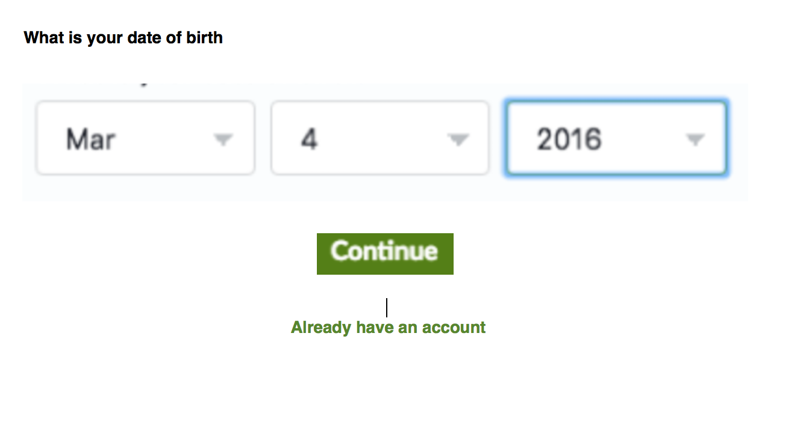
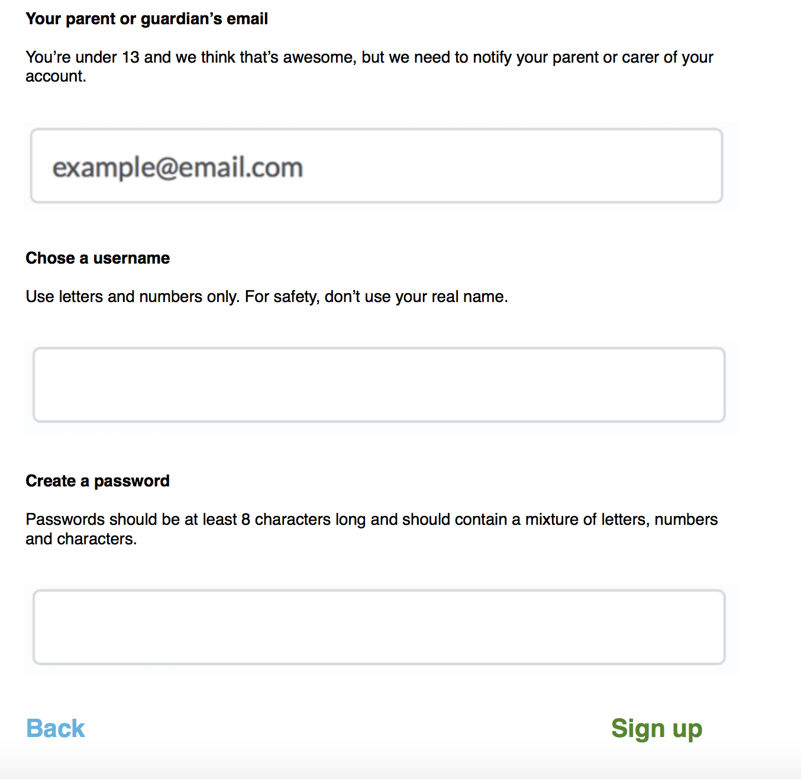
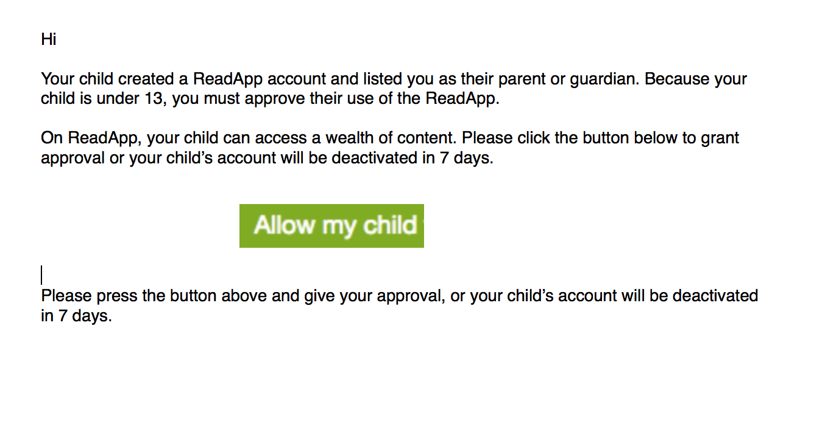
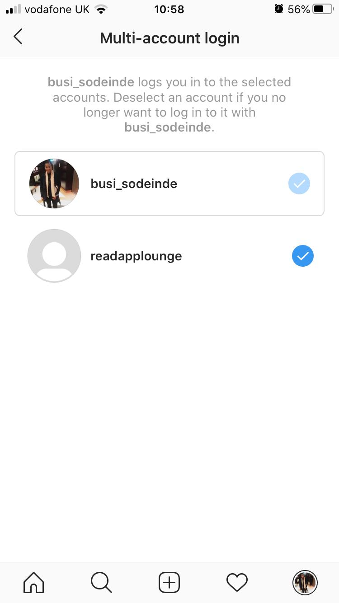

# Security

ReadApp implements three types of security controls: Preventive, Detective and Responsive. The application's security encompasses authentication, data protection, finding, fixing and preventing security vulnerabilities. 

Not only does ReadApp security architecture cover costs of protection, but also the awareness of the potential damage to those whose data we hold, and the penalties to which breaches of security would expose them.

- In line with GDPRK, GDPR-K(sub-section for children)/COPPA and in addressing Cybersecurity and data protection, we should be implementing a Parental Verification (PV) security model. This will be an option where parents will approve to their children engagement with the app. Parents will have to ensure they provide their email addresses, Credit Card to the ReadApp as verification where their children will be involved. This will complete the registration and acceptance of any child to use the app where applicable.
- The ReadApp will have to provision for multiple (Linked) log in accounts for example for supporting the PV. A parent can be an administrator, and at the same time have an account to be used for PV where they have children (see attached).

## Authentication :

[to come ]

- **Magic Links (Passwordless) -**  **Implemented**.

The ReadApp will additionally use Magic Links for authentication.  This will be a temporary URL that expires after use, or after a specific interval of time. Magic links will be sent to a users email address. Clicking the link will authorise the user to sign in.

## Encryption 

### Parental Verification (PV) - backlog

**Compliance with GDPR-K and COPPA (Child Safety) **

- Meta Compliance - [https://www.infosecurityeurope.com/__novadocuments/355669?v=636289786574700000](https://www.infosecurityeurope.com/__novadocuments/355669?v=636289786574700000)
- Complying with COPPA - [https://www.ftc.gov/tips-advice/business-center/guidance/complying-coppa-frequently-asked-questions](https://www.ftc.gov/tips-advice/business-center/guidance/complying-coppa-frequently-asked-questions)
- Security breaches -[https://www.bbc.co.uk/news/technology-52133349](https://www.bbc.co.uk/news/technology-52133349)
- Best Practices - [https://blog.back4app.com/2018/06/26/gdpr-best-practices/](https://blog.back4app.com/2018/06/26/gdpr-best-practices/)

**Architecture/Design**

** step 1 - Your date of birth **

** step 2 - Parental guardian's email **

step 3

### Linked Account

## Cybersecurity

Both personal data and sensitive personal data harvested by the ReadApp are covered by GDPR. 

Personal data for the ReadApp is classified as - a complex category of information. This information will be used to identify a person, such as name, address or IP address. Sensitive will  also include  pseudonymised personal data.

ReadApp will adopt homomorphic encryption algorithm technique as Searchable Encryption. Personal data harvested by ReadApp will be encrypted before it is sent to the database locally or on cloud. This will include anonymise search.

The encrypted data will be searchable and can be computed. The result is sent back to the client and is decrypted before its corresponding plain data is displayed on the user interface. The plain data will not be accessible to third parties whiles in transit.

**Targeted files for Searchable Encryption:**

1. Profile Component [https://github.com/ReadAppLounge/ReadAppLoungeMobile/blob/master/mobile/app/Dashboard/profile/ChangeDateOfBirth/index.tsx](https://github.com/ReadAppLounge/ReadAppLoungeMobile/blob/master/mobile/app/Dashboard/profile/ChangeDateOfBirth/index.tsx)
2. A component calls the method of user's model (context) [https://github.com/ReadAppLounge/ReadAppLoungeMobile/blob/1b5cd05c3f8d35a55b1b52120efbbb0abb06a855/mobile/app/onboarding/DateOfBirth/index.tsx#L14](https://github.com/ReadAppLounge/ReadAppLoungeMobile/blob/1b5cd05c3f8d35a55b1b52120efbbb0abb06a855/mobile/app/onboarding/DateOfBirth/index.tsx#L14)
3. The method of the user's model sends data to the graphql query [https://github.com/ReadAppLounge/ReadAppLoungeMobile/blob/1b5cd05c3f8d35a55b1b52120efbbb0abb06a855/mobile/app/common/UserContext/index.tsx#L70](https://github.com/ReadAppLounge/ReadAppLoungeMobile/blob/1b5cd05c3f8d35a55b1b52120efbbb0abb06a855/mobile/app/common/UserContext/index.tsx#L70)
4. The graphql query [https://github.com/ReadAppLounge/ReadAppLoungeMobile/blob/1b5cd05c3f8d35a55b1b52120efbbb0abb06a855/mobile/app/common/UserContext/graphql/update-user.graphql#L1](https://github.com/ReadAppLounge/ReadAppLoungeMobile/blob/1b5cd05c3f8d35a55b1b52120efbbb0abb06a855/mobile/app/common/UserContext/graphql/update-user.graphql#L1)

5. User Model (technical debt - extend to include DOB)

https://github.com/ReadAppLounge/ReadAppLoungeMobile/blob/master/frontend/components/common/types/user.ts

6. Model - DB Structure

https://whimsical.com/NrobsZni4CBtZMAsWdtHBk

ReadApp will be engineered to deal with the following Cyber attacks:

- **Malware** -  Malicious software, including spyware, ransomware, viruses, and worms.
- **Phishing** - Prevent  fraudulent practice of sending emails  to induce individuals to reveal personal information, such as passwords and credit card numbers.
- **Man-in-the-middle attack** - Prevent scrupulous users of the ReadApp  relaying and possibly altering comments or  communications between individuals or groups or from within a Lounge
- **Denial-of-service attack (DoS)** - Eliminate perpetrator seeking to make the ReadApp  and its network resource unavailable to its intended users
- **SQL injection** - Techniques to stop the injection of SQL code  that might destroy ReadApp's database.
- **Zero-day exploit** - Manage newly discovered software vulnerabilities, before hackers manage to exploit the security hole.
- **DNS Tunneling** - Configure ReadApp's firewall securely to detect and block DNS tunneling using protocol objects.
- The ReadApp will have to comply to "Architecting for High Availability" to guarantee improved Scaling, Resilience, Spikes and also limit resources when not needed: Mitigate and restore automatically points of failure, Provide Multiple Availability Zones (MAZ - Apps availability must be engineered to support geographical disasters to servers), Self Healing (Cloud Watch policies for CPU and network usage), and Loose Coupling. Can we confirm if Digital Ocean provides all these features.

## Permissions & Security Framework

- https://github.com/ReadAppLounge/docs/blob/master/Read%20App/permissions-security-framework.md

## Enablers

- TypeScript
- JWT  Tokens (Create)
- Access Tokens - OAuth(oauthConfig)
- API requests - next(Isomorphic Fetch)
- Cybersecurity - * Searchable Encryption
- Hasura Permissions and Access Controls
    - [Basics](https://hasura.io/docs/1.0/graphql/manual/auth/authorization/basics.html)
    - [Configuring Permissions Rules](https://hasura.io/docs/1.0/graphql/manual/auth/authorization/permission-rules.html#permission-rules)
