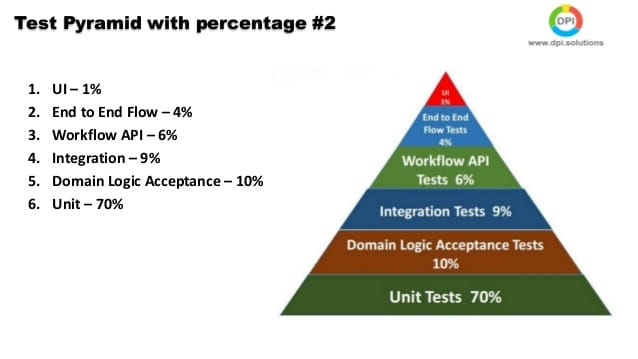

# Testing

## Credentials
# Test user of the app

[test@readlounge.com](mailto:test@readlounge.com)

123

## Test Flight

[https://testflight.apple.com/v1/invite/29901f689fbc45b88100b8ad099088cb24fbb630628f46aba1bb29d65d230312598d10cc?ct=3LS4V7786D&advp=10000&platform=ios](https://testflight.apple.com/v1/invite/29901f689fbc45b88100b8ad099088cb24fbb630628f46aba1bb29d65d230312598d10cc?ct=3LS4V7786D&advp=10000&platform=ios)

## Types to accomplish

- Unit
- Functional
- Regression
- Integration
- Smoke Testing
- Browser Compatibility Testing.
- Performance Testing.
- Security Testing.
- Production Monitoring.
- Usability Testing.
- System testing
- API Testing
- Content testing
- Interface Testing
- Database Testing
- Security testing
- UAT
- Crowd testing

## Reports

[Dashboard](Testing/Dashboard.md)

[Library](Testing/Library.md)

[Sign in/up, restore password](Testing/Sign%20in%20up%20restore%20password.md)

## Coverage

## Resources

- [https://github.com/kukuu/AGILITY/blob/master/software-testing-life-cycle.md](https://github.com/kukuu/AGILITY/blob/master/software-testing-life-cycle.md)
